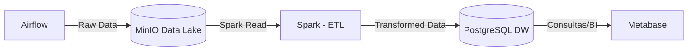

## 🏗️ Infraestrutura Geral

Todos os serviços containerizados via **Docker Compose**:

### 📊 Diagrama do Pipeline

| Componente     | Função                          |
| -------------- | ------------------------------- |
| **Fetcher**    | Ingestão de dados               |
| **MinIO**      | Armazenamento em Raw Data (CSV) |
| **Processor**  | ETL / Transformações            |
| **PostgreSQL** | Data Warehouse (Gold Layer)     |
| **Metabase**   | Visualização e insights         |
